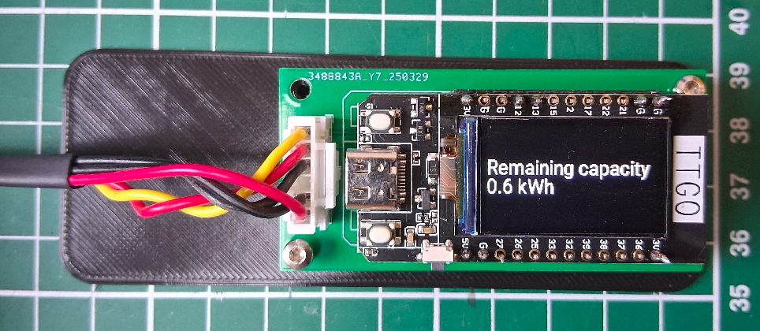

# MarstekMonitor

Small device with integrated display to monitor Marstek Venus battery systems.

Works on the 5.12kWh and 2.56kWh Marstek Venus battery.

Thanks to Superduper1969 and Tweakers (in Dutch) for EPSHome config and Modbus communication.

https://gathering.tweakers.net/forum/list_messages/2282240/0

## Main features
-Plugs directly into the RS485 port on the side of the battery

-Display shows:

Battery Operating Mode (Idle, Charge, Discharge)

Charge/Discharge power

Battery SoC (State of Charge)

Charging Strategy (Auto, AI, Custom)

-No separate power supply needed

-(optional) Can be connected to WiFi to monitor/control the battery remotely (eg. Home Assisstant)

## HW v0.1
HW v0.1 is meant to be a proof of concept only. It consists of nothing more than a carrier board for the various modules.

09-04-2025: v0.1 assembled and working! There are a few minor issues that will be solved in the next version. See below.

Partlist:
1. MarstekMonitor v0.1 PCB 
2. LilyGo ESP32 T-Display v1.1 [link](https://www.tinytronics.nl/en/development-boards/microcontroller-boards/with-wi-fi/lilygo-ttgo-t-display-v1.1-esp32-with-1.14-inch-tft-display "Webshop").
3. Buck-Boost converter [link](https://www.tinytronics.nl/en/power/voltage-converters/buck-boost-(step-up-down)-converters/dc-dc-step-up-down-buck-boost-converter-0.6a-5v-output "Webshop").
4. RS485-Serial module <link>.
5. 3d Printed enclosure (TODO)
6. Weipu RS485 connector (TODO add exact partnumber)

### Known issues with HW v0.1
These will be solved in the next HW iteration
1. GPIO12 used for RS485. GPIO12 is an ESP32 strapping pin. This can cause issues on reset.
2. Switch to right-angle JST-XH connector
3. Footprint for Buck-boost and RS485 module: TH diameter slighty too small. Modules fit, but need to be forced in.
4. Silkscreen for Lilygo T-display does not match actual footprint
5. Panel mount Weipu 6p connector does not seem to exist. 

